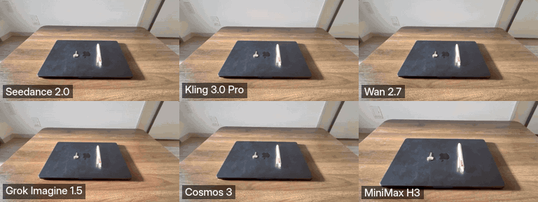

<div align="center">

# Ego2Act

### Evaluating Goal-Directed Manipulation in Egocentric Video Generation

[](https://arxiv.org/abs/2610.01092)
[](https://ego2act.github.io)
[](https://huggingface.co/datasets/ego2act/ego2act-bench)
[](https://huggingface.co/datasets/ego2act/ego2act-vidgen)
[](pyproject.toml)



*One start image, one goal, six generators (seed 101). Ego2Act scores whether the goal was reached and whether the physics held.*

</div>

Ego2Act is a benchmark of 110 real-world egocentric manipulation tasks. A video model is given an
initial scene and a high-level goal (*"Laptop lid open, with the key and pen placed together on the
left side of the laptop"*) and must generate the whole manipulation. **Ego2ActJudge** scores each
generated video **without a reference video**:

- **Task** completion, with gates T1–T3 per subgoal
- **Physics** plausibility, with gates P1–P4 per interaction
- **Final** = √(Task × Physics), all on a 0–100 scale

```text
start image + goal ──► ego2act generate ──► video ──► ego2act judge ──► Task · Physics · Final
```

Results, example rollouts and failure analysis are on the [project page](https://ego2act.github.io).

## Quick start

```bash
git clone https://github.com/ego2act/ego2act && cd ego2act
pip install -e ".[data]"
cp .env.example .env                 # add OPENROUTER_API_KEY (not needed for the paper tables)
```

**Recreate the paper's tables and figures** (free, offline, minutes):

```bash
python analysis/reproduce.py --verify
```

**Score a video** with Ego2ActJudge (needs `OPENROUTER_API_KEY`):

```bash
ego2act data pull --subset cases     # start images and prompts, small
ego2act judge video --video attempt.mp4 --initial-image data/ego2act/laptop_open/start.jpg \
  --goal "Laptop lid open, with the key and pen placed together on the left side of the laptop."
```

**Generate a video** from a start image and a goal (a dry run first, `--run` spends money):

```bash
ego2act generate laptop_open --model wan_2_7
ego2act generate laptop_open --model wan_2_7 --run
```

## Data

The data lives in two dataset repos on the Hugging Face Hub.

| Repo | Holds |
|---|---|
| [`ego2act/ego2act-bench`](https://huggingface.co/datasets/ego2act/ego2act-bench) | the tasks (start image, goal, prompt, metadata) and the human recordings at 480p |
| [`ego2act/ego2act-vidgen`](https://huggingface.co/datasets/ego2act/ego2act-vidgen) | generated videos as individual mp4 files, Ego2ActJudge, baseline and human scores, and the judge's traces |

```bash
ego2act data pull --subset cases                        # start images, prompts, metadata (small)
ego2act data pull --subset human                        # human correct and wrong recordings
ego2act data pull --subset generated --model wan_2_7    # one generator's videos
ego2act data pull --subset traces                       # judge traces for analysis/reproduce.py (about 40 MB)
```

Files land in `data/ego2act/<case>/…`, the layout every command expects (see [`data/README.md`](data/README.md)).
The tables load directly with `datasets`.

```python
from datasets import load_dataset

cases  = load_dataset("ego2act/ego2act-bench", "cases", split="train")
scores = load_dataset("ego2act/ego2act-vidgen", "judge_scores", split="train")
```

## Use your own data

A case is a folder. This is the only format the commands need.

```text
<case>/
├── start.jpg        initial scene
├── prompt.txt       generation prompt with one "Goal: ..." line        (generate)
├── metadata.json    {"goal": "..."}, optional when prompt.txt exists    (judge, baselines)
└── AI/<model>/<model>__seed_<seed>.mp4                                  (written by generate)
```

```bash
ego2act generate my_case --model wan_2_7 --data-root my_cases --run
ego2act judge batch --data my_cases                  # every video under every case, resumable
```

## Reproduce the paper

| Layer | What | Command | Needs |
|---|---|---|---|
| **A** | every table and figure from the stored scores | `python analysis/reproduce.py [--verify]` | nothing |
| **B** | re-score the videos | `ego2act data pull --subset all` → `ego2act judge batch` → `ego2act baseline <method>` | API key, and a GPU for two baselines |
| **C** | ablations and studies | scripts in [`analysis/studies/`](analysis/studies) | API key, layer B data |

`--verify` regenerates every result and table and fails if any number differs from the committed files.
Three builders (judge gate ablation, subgoal action types, plan stability) read the judge traces. They are
skipped with a message until you run `ego2act data pull --subset traces`. Each builder and the paper output
it produces are listed in [`analysis/README.md`](analysis/README.md).

## Repository layout

```text
ego2act/         the package
  judge/           Ego2ActJudge: plans, Task gates T1–T3, Physics gates P1–P4, prompts
  vidgen/          video generation for the six evaluated models
  data.py, hub.py  case folders, and `ego2act data pull`
baselines/       six baseline adapters on pinned upstream code
analysis/        reproduce.py and one builder per table and figure
  csv/             the stored scores behind every paper number
  rubrics/         Task and Physics annotation rubrics
  results/, tables/, studies/
assets/          README teaser
data/            the benchmark, pulled from the Hub (not tracked in git)
config.yaml      generation and baseline settings
tests/           pytest -q
```

**Models.** All six get the same prompt template, 480p output and seeds 101, 202 and 303. The settings are in
[`config.yaml`](config.yaml).

| Model | Access | Version | Notes |
|---|---|---|---|
| Seedance 2.0 | OpenRouter | `bytedance/seedance-2.0` | 16:9, up to 15 s |
| Kling 3.0 Pro | OpenRouter | `kwaivgi/kling-v3.0-pro` | 16:9, up to 15 s |
| Wan 2.7 | OpenRouter | `alibaba/wan-2.7` | 16:9, up to 10 s, its maximum |
| Grok Imagine 1.5 | OpenRouter | `x-ai/grok-imagine-video-1.5` | 16:9, up to 15 s |
| MiniMax H3 | local, SGLang | `MiniMaxAI/MiniMax-H3` | 4:3 native, up to 15 s, 24 fps, 35 steps |
| **Cosmos 3 Nano** | local, SGLang | `nvidia/Cosmos3-Nano` | 16:9, up to 15 s, 24 fps, 35 steps, guidance 4.0, flow shift 10.0 |

The two local models run on a server reached through `EGO2ACT_API_URL` and were run on NVIDIA A100 hardware.
Cosmos 3 Nano is the Nano variant of Cosmos 3, so its results describe that variant only.

The judge uses `google/gemini-3.7-flash` through OpenRouter. Its settings are in `ego2act/judge/main.py`
(`PAPER_PROVIDER`) and its prompts in `ego2act/judge/prompts.py`. Baselines are described in
[`baselines/README.md`](baselines/README.md).

## License and citation

The code is MIT licensed and the data is CC BY 4.0.

```bibtex
@article{ego2act2026,
  title   = {Ego2Act: Evaluating Goal-Directed Manipulation in Egocentric Video Generation},
  author  = {Irawan, Patrick Amadeus and Parlambang, Iskandar Muda Rizky and Maulana, Rava and Cui, Qinrong and Fuadi, Erland Hilman and Zuhri, Zayd M. K. and Absar, Nanda Ryaas and Elshabrawy, Ahmed and Mulyawan, Wilfried Ariel and Yu, Shoubin and Zhang, Yue and Bansal, Mohit and Aji, Alham Fikri},
  journal = {arXiv preprint arXiv:2610.01092},
  year    = {2026}
}
```
